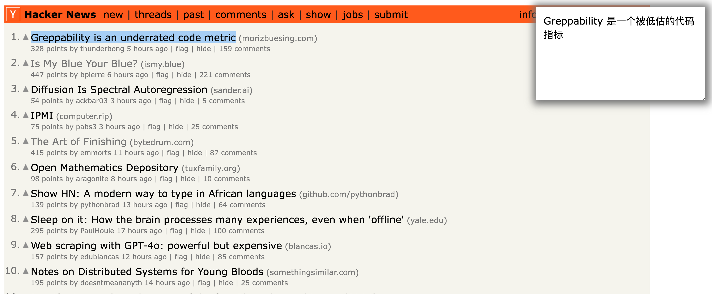
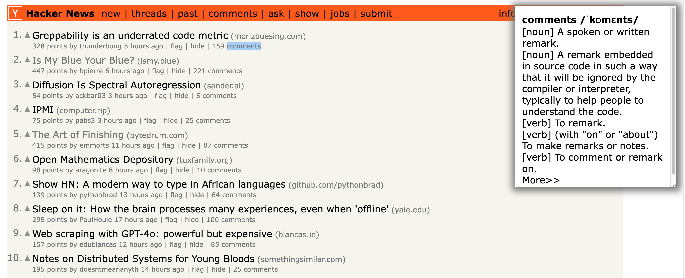

# Introduction
A chrome extension that instantly translation by selecting text without any other click, no extra clicks needed, Making translation more intuitive and efficient.

There are three main features
+ Translate immediately after selecting text, don't need to click the icon like other translation extension.
+ Pop a frame in top right corner of current window to show the translation, which don't cover the contens you are browsering
+ Show dictionary content for single word, which is suitable for new language learner. This feature is turned off by default.

    

# Realize
The translation function is from Google api. 

Dictionary is from [Free Dictionary API](https://dictionaryapi.dev), Thanks a lot.

Any suggestions and feedback are welcome.

# TODO
- [ ] Optimize request order: for work, it's not necessary to request google api
- [ ] More languages support for dictionary: English is only language to support temporary.
- [ ] Fix bugs: This is not a mature product, it need more time to find bug and fix them.

# Thanks
+ [Free Dictionary API](https://dictionaryapi.dev)